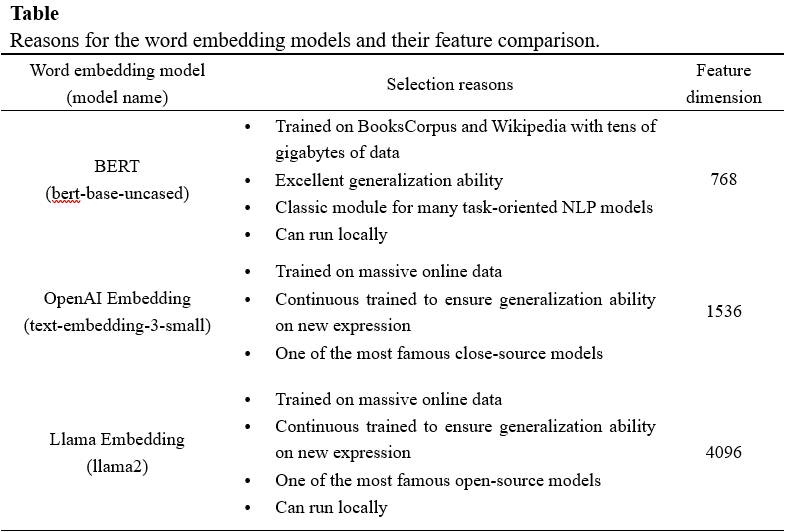
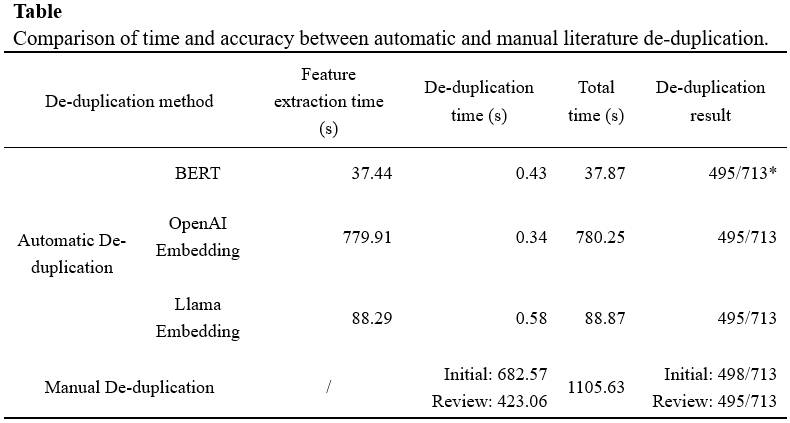

# LLM-Based Paper Review of VOT applications in Construction Site Management

[TOC]

## Project Introduction

This project provides a LLM-based fast eligible literature filtering strategy during a review based on the PRISMA framework. This strategy is able to accommodate data from multiple sources, such as WoS, Scopus, ASCE Library. The following is the detail related to this project.

+ `1. Remove Duplicate.ipynb`：This file is used to handle the problem of multiple source files with duplicate items. This code uses a word embedding based approach to filter duplicate items by comparing the embedding of titles/abstracts of different items. The project compares the performance of three different word embedding models: BERT, OpenAI Embedding, Llama Embedding.
+ `2. Paper Classification.ipynb`：This file is used to filter items that do not match the review topic. This part was achieved by large language model (LLM). The model used in this code was OpenAI's gpt-4o-mini-2024-07-18.

## Results

+ Literature de-duplication results \[performance comparison of different models\]

  

+ Non-eligible articles filtering results

  

\* Note: Although this code is developed based on the topic of VOT applications in Construction Site management, this filtering framework can be transferred to review articles in other fields. The application of this project only requires modifying the LLM prompt based on domain knowledge.